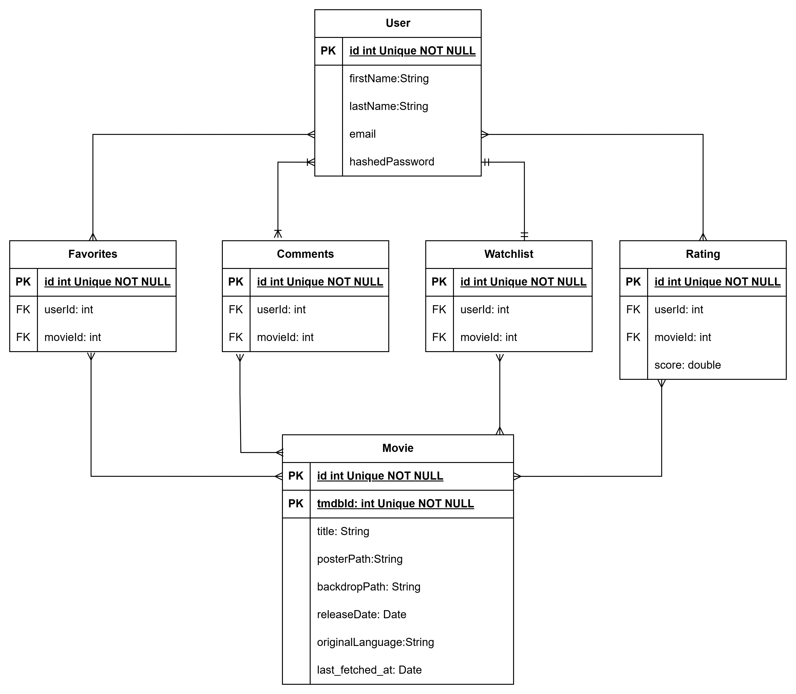

# tp2-trabajo-practico

## Dependencias
`npm install bcrypt@^6.0.0 dotenv@^17.2.3 express@^5.1.0 pg@^8.16.3 pg-hstore@^2.3.4 sequelize@^6.37.7 sqlite3@^5.1.7`

## Database Diagram
LINK: https://drive.google.com/file/d/1_u7XAstyqQrD55QHbjv_OkbR4zF5ThhJ/view?usp=sharing


# 📌 Endpoints Table to Test

## 🎬 Sample Movie IDs
| tmdbId |
|--------|
| 500 |
| 402431 |
| 1242898 |

---

## 👤 Registration & Login

| Use Case | Method | Code Snippet |
|----------|--------|--------------|
| Register | POST | ```POST http://localhost:3000/api/users/register\n{\n "firstName": "newUser",\n "lastName": "Last",\n "age": 33,\n "username": "new.user",\n "email": "new@gmail.com",\n "password": "Adrian!1"\n}``` |
| Login | POST | ```POST http://localhost:3000/api/users/login\n{\n "email": "adrian.addesso@gmail.com",\n "password": "Adrian!1",\n "rememberMe": false\n}``` |

---

## 📺 Watchlist

| Use Case | Method | Code Snippet |
|----------|--------|--------------|
| Get Watchlist | GET | ```GET http://localhost:3000/api/watchlist/all\nAuthorization: Bearer <token>``` |
| Add to Watchlist (1) | POST | ```POST http://localhost:3000/api/watchlist/1\nAuthorization: Bearer <token>``` |
| Add to Watchlist (0 / 1 / 2) | POST | ```POST http://localhost:3000/api/watchlist/{id}\nAuthorization: Bearer <token>``` |
| Get Added Item | GET | ```GET http://localhost:3000/api/watchlist/1\nAuthorization: Bearer <token>``` |
| Delete Added Item | DELETE | ```DELETE http://localhost:3000/api/watchlist/1\nAuthorization: Bearer <token>``` |
| Delete Entire Watchlist | DELETE | ```DELETE http://localhost:3000/api/watchlist/reset\nAuthorization: Bearer <token>``` |
| Get Watchlist Again | GET | ```GET http://localhost:3000/api/watchlist/all\nAuthorization: Bearer <token>``` |

---

## 🎞️ Movies

| Use Case | Method | Code Snippet |
|----------|--------|--------------|
| Create Movie | POST | ```POST http://localhost:3000/api/movies\n{\n "tmdbId": 500,\n "title": "Inception",\n "posterPath": "p/123",\n "releaseDate": "2010-07-16"\n}``` |
| Get All Movies | GET | ```GET http://localhost:3000/api/movies``` |
| Get Movie by Id | GET | ```GET http://localhost:3000/api/movies/{id}``` |

---

## 💬 Comments

| Use Case | Method | Code Snippet |
|----------|--------|--------------|
| Create Comment | POST | ```POST http://localhost:3000/api/comments\nAuthorization: Bearer <token>\n{\n "movieId": 5,\n "comment": "Great movie! Loved the ending."\n}``` |
| Get Movie Comments | GET | ```GET http://localhost:3000/api/movies/5/comments``` |
| Delete Comment | DELETE | ```DELETE http://localhost:3000/api/comments/{commentId}\nAuthorization: Bearer <token>``` |

---

## ⭐ Favorites

| Use Case | Method | Code Snippet |
|----------|--------|--------------|
| Add Favorite | POST | ```POST http://localhost:3000/api/favorites\nAuthorization: Bearer <token>\n{\n "userId": 11,\n "movieId": 1\n}``` |
| Get User Favorites | GET | ```GET http://localhost:3000/api/favorites/user/11\nAuthorization: Bearer <token>``` |
| Check Favorite | GET | ```GET http://localhost:3000/api/favorites/check/11/5\nAuthorization: Bearer <token>``` |
| Remove Favorite | DELETE | ```DELETE http://localhost:3000/api/favorites\nAuthorization: Bearer <token>\n{\n "userId": 11,\n "movieId": 1\n}``` |

---

## ⭐ Ratings

| Use Case | Method | Code Snippet |
|----------|--------|--------------|
| Add Rating | POST | ```POST http://localhost:3000/api/ratings\nAuthorization: Bearer <token>\n{\n "userId": 11,\n "movieId": 1,\n "score": 4.5\n}``` |
| Attempt Duplicate Rating | POST | ```POST http://localhost:3000/api/ratings\nAuthorization: Bearer <token>\n{\n "userId": 11,\n "movieId": 1,\n "score": 2\n}``` |
| Update Rating | PUT | ```PUT http://localhost:3000/api/ratings\nAuthorization: Bearer <token>\n{\n "userId": 11,\n "movieId": 1,\n "score": 3.0\n}``` |
| Get User Ratings | GET | ```GET http://localhost:3000/api/ratings/user/11\nAuthorization: Bearer <token>``` |
| Check If Movie Rated | GET | ```GET http://localhost:3000/api/ratings/check/11/1\nAuthorization: Bearer <token>``` |
| Delete Rating | DELETE | ```DELETE http://localhost:3000/api/ratings\nAuthorization: Bearer <token>\n{\n "userId": 11,\n "movieId": 1\n}``` |
